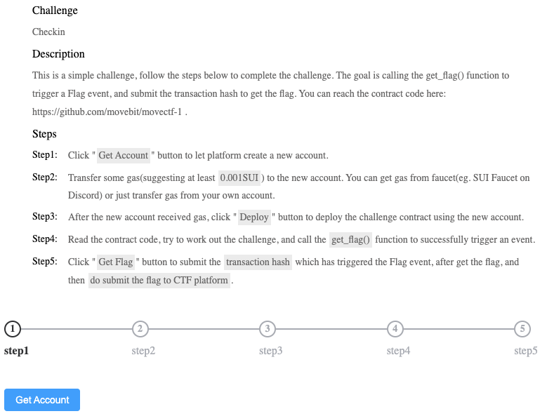
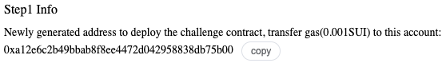
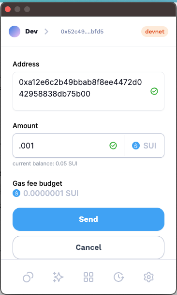
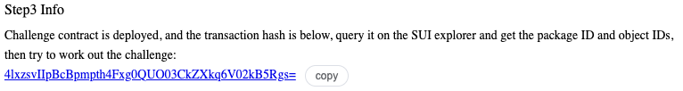
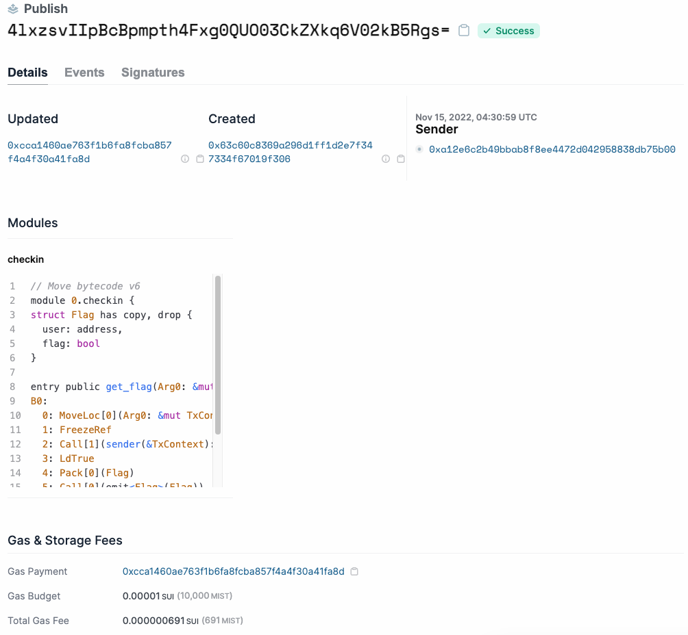
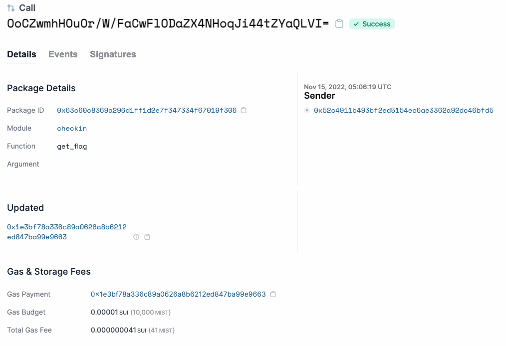
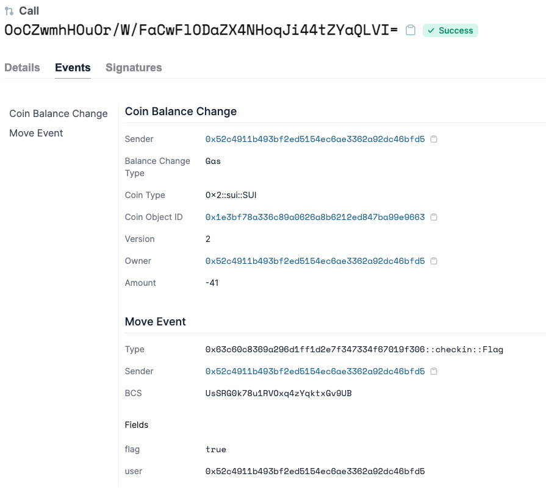
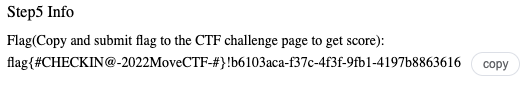

# Move CTF Writeup

## Introduction

This CTF is an capture the flag event that was hosted to promote the new [smart contract](#terminology) language, Move. This event was sponsored heavily by Sui, one of the newest blockchains, which uses Move for their smart contracts. 

The event contains four challenges. The first challenge is a easy challenge to get participants used to the Sui/Move environment. The second challenge is the hardest in the event. The last two are two medium challenges. 

All challenges follow the same format. First, you receive the address of the account that will be deploying the challenges' smart contract. Second, you have to send the account some Sui tokens that the account will use for gas, when deploying the smart contract. Once funded, the account will deploy the smart contract. Each deployed smart contract will have a function called `get_flag()`. Calling this function will emit a flag event on the blockchain. Once the participant figures out how to emit the flag event, they can submit the associative transaction hash to the event to get it confirmed. Once confirmed, the challenge has been completed. 

### Terminology
- **Smart contract:** A program that is deployed onto the blockchain and runs autonomously on chain forever. A smart contract on Move oriented blockchains are called Modules as well. 

## First challenge: Checkin

**Challenge interface:**

**Challenge steps:**

1. Get address of the account that will be deploying the smart contract. 

    <figure>
      
      <figcaption>The address of the deployer account</figcaption>
    </figure>  

2. Send Sui to account. To send the Sui to the account, you need to have an Sui account and have it connected to a Sui browser wallet. 

    <figure>
      
      <figcaption>Executing transaction on the Suiet wallet</figcaption>
    </figure>  

3. Once the Sui is sent to the account, hit the *deploy* button. 

    <figure>
      
      <figcaption>Confirmation of contract deployment, with deployment transaction hash</figcaption>
    </figure>  

    <figure>
      
      <figcaption>Viewing the transaction hash on the Sui blockchain explorer. The deployment information can be seen as well as the bytecode for the smart contract.</figcaption>
    </figure>  

4. Figure out how to get the flag.
  
    The first step is to take a look at the smart contract source code provided by the event. 

        module movectf::checkin {
          use sui::event;
          use sui::tx_context::{Self, TxContext};

          struct Flag has copy, drop {
              user: address,
              flag: bool
          }

          public entry fun get_flag(ctx: &mut TxContext) {
              event::emit(Flag {
                  user: tx_context::sender(ctx),
                  flag: true
              })
          }
        }

    In the source code of the deployed [module](#terminology) called `movectf::checkin`, you can see that the `get_flag()` function has the `entry` function modifier. This modifier means that this function can be called via a script. Functions without this modifier can only be called by other Modules on the chain. 

    In this writeup, the scripts that will be used to interact with the modules will be written in Typescript.

        // Sui library for interacting with the Sui blockchain
        import { Ed25519Keypair, JsonRpcProvider, RawSigner } from '@mysten/sui.js';
        // Env
        import dotenv from "dotenv";

        const MODULE_ADDRESS = '0x63c60c8369a296d1ff1d2e7f347334f67019f306'

        async function main () {

          // Get dev account private key from env
          dotenv.config();
          const privKey = process.env.RECOVERY_PHRASE || '';

          // connect to local RPC server
          const provider = new JsonRpcProvider();

          // Create a signer from the private key
          const keyPair = Ed25519Keypair.deriveKeypair(process.env.RECOVERY_PHRASE || 'hell0')
          const signer = new RawSigner(keyPair, provider);

          // Fund the account if needed
          const balance = await provider.getCoinBalancesOwnedByAddress(
            await signer.getAddress()
          );
          if (balance.length === 0) {
            console.log('Funding account...');
            await provider.requestSuiFromFaucet(await signer.getAddress());
          }

          // Print the dev account address
          console.log(`Signer address: ${await signer.getAddress()}`)

          // Called the get_flag method on the module
          const moveCallTxn = await signer.executeMoveCallWithRequestType({
            packageObjectId: MODULE_ADDRESS,
            module: 'checkin',
            function: 'get_flag',
            typeArguments: [],
            arguments: [],
            gasBudget: 10000,
          });

          // Print the result of the function call
          console.log('moveCallTxn', moveCallTxn);
          
          return;
        }

        main()

    Once we have this script, we can use it to call the `get_flag()` function. 

    Results from calling the script:
    
        Signer address: 52c4911b493bf2ed5154ec6ae3362a92dc46bfd5
        moveCallTxn {
          EffectsCert: {
            certificate: {
              transactionDigest: 'OoCZwmhHOuOr/W/FaCwFlODaZX4NHoqJi44tZYaQLVI=',
              data: [Object],
              txSignature: 'AJ3wWmksAmW1tUVVC6ITo7EMKWtXEnutP4An5LlybTjuq+zwsrnHC7h4fdscZYOmDw3Odm9QImfFkFMrLff0vgmDq1oG00MuzZJsuMianfQuMmmMQnD1T1lfB090l9ULTA==',
              authSignInfo: [Object]
            },
            effects: {
              transactionEffectsDigest: '3tdXkyD2eC/cse96/7zgPUsNeI0bKiN7j6kXaC3oTaE=',
              effects: [Object],
              authSignInfo: [Object]
            },
            confirmed_local_execution: true
          }
        }
    
    The results from the script shows the dev address as well as the transaction information, including the transaction hash which we could use to look up the transaction in the [Sui block explorer](#terminology).

    <figure>
      
      <figcaption>The explorer page for the transaction with the module</figcaption>
    </figure>  

    <figure>
      
      <figcaption>The explorer page showing the events emitted during the transaction. The `Flag` event is emitted.</figcaption>
    </figure>  

    The transaction hash associated with the transaction where the `Flag` event was emitted can now be submitted.

    <figure>
      
      <figcaption>The confirmation of the flag event being emitted in the submitted transaction hash.</figcaption>
    </figure>  

  5. Once the transaction hash is confirmed, the given confirmation can be turned in on the event's challenge dashboard for the credit from completing the challenge.

